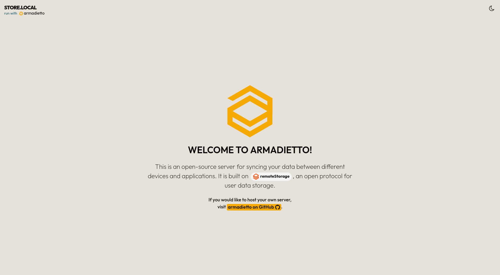

<!--
N.B.: This README was automatically generated by <https://github.com/YunoHost/apps/tree/master/tools/readme_generator>
It shall NOT be edited by hand.
-->

# Armadietto for YunoHost

[](https://dash.yunohost.org/appci/app/armadietto)  

[](https://install-app.yunohost.org/?app=armadietto)

*[Read this README in other languages.](./ALL_README.md)*

> *This package allows you to install Armadietto quickly and simply on a YunoHost server.*  
> *If you don't have YunoHost, please consult [the guide](https://yunohost.org/install) to learn how to install it.*

## Overview

[Armadietto](https://github.com/remotestorage/armadietto/) is a [remoteStorage](https://remotestorage.io) server written for Node.js.

Armadietto is maintained by the remoteStorage community, ([IRC](https://web.libera.chat/#remotestorage), [forums](https://community.remotestorage.io/)).

> ### :warning: WARNING
> Please do not consider `armadietto` production ready, this project is still
> considered experimental.  As with any alpha-stage storage technology, you
> MUST expect that it will eat your data and take precautions against this. You
> SHOULD expect that its APIs and storage schemas will change before it is
> labelled stable.

### Installation option 

User registration is not allowed out of the box.
This option can be enabled in the configuration panel.

### Application for remoteStorage

[Here](https://remotestorage.io/apps/) is a non-exhaustive list of apps that have integrated remoteStorage as a storage/sync option.


**Shipped version:** 0.2.0~ynh3

## Screenshots




## :red_circle: Antifeatures

- **Alpha software**: Early development stage. May contain changing or unstable features, bugs, and security vulnerability.

## Documentation and resources

- Official app website: <https://remotestorage.io/>
- Upstream app code repository: <https://github.com/remotestorage/armadietto>
- YunoHost Store: <https://apps.yunohost.org/app/armadietto>
- Report a bug: <https://github.com/YunoHost-Apps/armadietto_ynh/issues>

## Developer info

Please send your pull request to the [`testing` branch](https://github.com/YunoHost-Apps/armadietto_ynh/tree/testing).

To try the `testing` branch, please proceed like that:

```bash
sudo yunohost app install https://github.com/YunoHost-Apps/armadietto_ynh/tree/testing --debug
or
sudo yunohost app upgrade armadietto -u https://github.com/YunoHost-Apps/armadietto_ynh/tree/testing --debug
```

**More info regarding app packaging:** <https://yunohost.org/packaging_apps>
