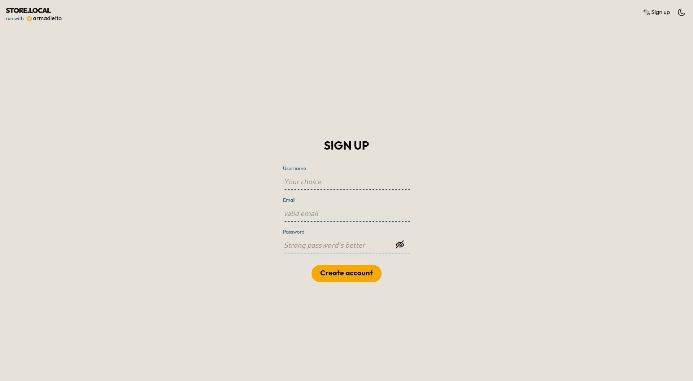
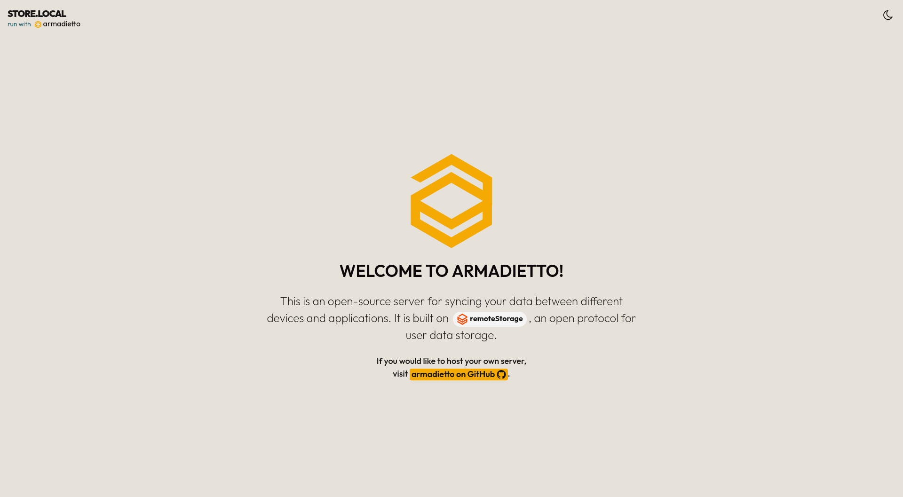

<!--
Este archivo README esta generado automaticamente<https://github.com/YunoHost/apps/tree/master/tools/readme_generator>
No se debe editar a mano.
-->

# Armadietto para Yunohost

[](https://ci-apps.yunohost.org/ci/apps/armadietto/)


[](https://install-app.yunohost.org/?app=armadietto)

*[Leer este README en otros idiomas.](./ALL_README.md)*

> *Este paquete le permite instalarArmadietto rapidamente y simplement en un servidor YunoHost.*  
> *Si no tiene YunoHost, visita [the guide](https://yunohost.org/install) para aprender como instalarla.*

## Descripción general

[Armadietto](https://github.com/remotestorage/armadietto/) is a [remoteStorage](https://remotestorage.io) server written for Node.js.

Armadietto is maintained by the remoteStorage community, ([IRC](https://web.libera.chat/#remotestorage), [forums](https://community.remotestorage.io/)).

> ### :warning: WARNING
> Please do not consider `armadietto` production ready, this project is still
> considered experimental.  As with any alpha-stage storage technology, you
> MUST expect that it will eat your data and take precautions against this. You
> SHOULD expect that its APIs and storage schemas will change before it is
> labelled stable.

### Installation option 

User registration is not allowed out of the box.
This option can be enabled in the configuration panel.

### Application for remoteStorage

[Here](https://remotestorage.io/apps/) is a non-exhaustive list of apps that have integrated remoteStorage as a storage/sync option.


**Versión actual:** 0.6.0~ynh2

## Capturas




## :red_circle: Características no deseables

- **Alpha software**: Early development stage. May contain changing or unstable features, bugs, and security vulnerability.

## Documentaciones y recursos

- Sitio web oficial: <https://remotestorage.io/>
- Repositorio del código fuente oficial de la aplicación : <https://github.com/remotestorage/armadietto>
- Catálogo YunoHost: <https://apps.yunohost.org/app/armadietto>
- Reportar un error: <https://github.com/YunoHost-Apps/armadietto_ynh/issues>

## Información para desarrolladores

Por favor enviar sus correcciones a la [rama `testing`](https://github.com/YunoHost-Apps/armadietto_ynh/tree/testing).

Para probar la rama `testing`, sigue asÍ:

```bash
sudo yunohost app install https://github.com/YunoHost-Apps/armadietto_ynh/tree/testing --debug
o
sudo yunohost app upgrade armadietto -u https://github.com/YunoHost-Apps/armadietto_ynh/tree/testing --debug
```

**Mas informaciones sobre el empaquetado de aplicaciones:** <https://yunohost.org/packaging_apps>
